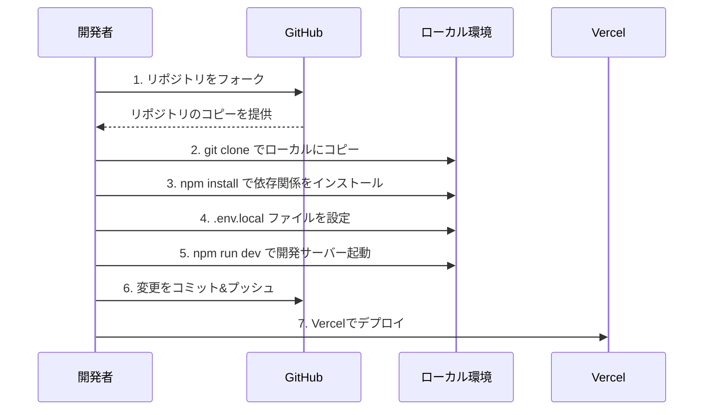
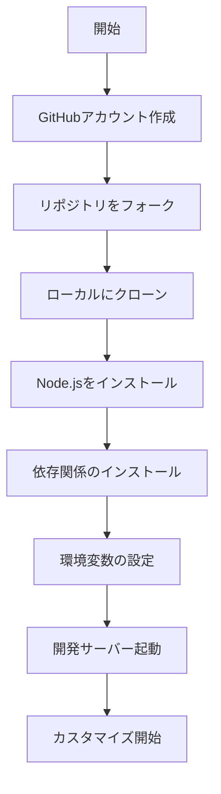

# ポートフォリオサイト

## プロジェクト概要

Next.js、TypeScript、Tailwind CSS を使用したモダンなポートフォリオサイトです。ダークモード対応とレスポンシブデザインを実装しています。

## 技術スタック

### フロントエンド

- **Next.js** (v14.1.0) - Reactベースのフレームワーク
  - App Router採用
  - サーバーサイドレンダリング (SSR)
  - 画像最適化
- **TypeScript** (v5.3.3) - 型安全なJavaScript
- **Tailwind CSS** (v3.4.1) - ユーティリティファーストのCSSフレームワーク
- **shadcn/ui** - モダンなUIコンポーネント

### バックエンド

- **Next.js API Routes** - サーバーレスAPI
- **SendGrid** - メール送信サービス

### 開発ツール

- **ESLint** - コード品質管理
- **Prettier** - コードフォーマッター
- **PostCSS** - CSSプロセッサー

## 主な機能

1. **レスポンシブデザイン**

   - モバイル、タブレット、デスクトップ対応
   - フレキシブルなレイアウト

2. **ダークモード**

   - システム設定との連動
   - 手動切り替え機能
   - ローカルストレージでの設定保存

3. **プロジェクトギャラリー**

   - プロジェクト一覧表示
   - 詳細ページ
   - 画像最適化

4. **スキルセクション**

   - スキルレベルの視覚化
   - カテゴリー分類

5. **コンタクトフォーム**

   - SendGrid統合
   - フォームバリデーション
   - 送信状態管理

6. **SEO対応**
   - メタタグ最適化
   - レスポンシブ画像
   - セマンティックHTML

## 初期セットアップ

### 必要条件

- Node.js 16.x 以上
- npm または yarn
- Git

### インストール手順

```bash
# 1. リポジトリのクローン
git clone [リポジトリURL]

# 2. プロジェクトディレクトリに移動
cd [プロジェクト名]

# 3. 依存関係のインストール
npm install
# または
yarn install

# 4. 環境変数の設定
cp .env.example .env.local
# .env.localファイルを編集し、必要な環境変数を設定

# 5. 開発サーバーの起動
npm run dev
# または
yarn dev
```

### 環境変数の設定

```env
# SendGrid API Key
SENDGRID_API_KEY=your_sendgrid_api_key

# コンタクトフォームの送信先・送信元メールアドレス
CONTACT_FORM_TO_EMAIL=your-email@example.com
CONTACT_FORM_FROM_EMAIL=no-reply@your-domain.com

# Frontend URL for CORS (optional, defaults to '*' in development)
NEXT_PUBLIC_FRONTEND_URL=http://localhost:3000
```

## Vercelへのデプロイ方法

1. **Vercelアカウントの作成**

   - [Vercel](https://vercel.com)にアクセス
   - GitHubアカウントでサインアップ

2. **プロジェクトのインポート**

   - New Projectボタンをクリック
   - GitHubリポジトリを選択

3. **環境変数の設定**

   - Settings > Environment Variables
   - `.env.local`の内容を追加

4. **デプロイ設定**

   - Framework Preset: Next.js
   - Build Command: `next build`
   - Output Directory: `.next`

5. **デプロイの実行**

   - Deployボタンをクリック
   - ビルドログを確認

6. **ドメイン設定（オプション）**
   - Settings > Domains
   - カスタムドメインの追加と設定

### 自動デプロイ

- mainブランチへのプッシュで自動デプロイ
- プレビューデプロイ（PR作成時）
- 環境ごとのデプロイ（本番/開発）

## プロジェクト構造の詳細説明

```
src/
├── app/                    # Next.js 13+ App Router
│   ├── layout.tsx         # ルートレイアウト（共通レイアウト）
│   ├── page.tsx           # メインページ（ホーム）
│   └── globals.css        # グローバルスタイル
│
├── components/            # 再利用可能なコンポーネント
│   ├── Hero.tsx          # ヒーローセクション
│   ├── Projects.tsx      # プロジェクト一覧
│   ├── About.tsx         # 自己紹介
│   ├── Skills.tsx        # スキルセット
│   ├── Contact.tsx       # コンタクトフォーム
│   └── ui/               # 基本UIコンポーネント
│       ├── Button.tsx
│       ├── Card.tsx
│       └── Input.tsx
│
├── context/              # Reactコンテキスト
│   └── ThemeContext.tsx  # テーマ管理（ダークモード）
│
├── lib/                  # ユーティリティ関数と定数
│   ├── projects.ts       # プロジェクトデータ
│   └── skills.ts         # スキルデータ
│
├── pages/                # ページコンポーネント（従来のPages Router）
│   ├── api/             # APIエンドポイント
│   │   └── contact.ts   # コンタクトフォームAPI
│   └── projects/        # プロジェクト詳細ページ
│       └── [slug].tsx   # 動的ルーティング
│
├── public/              # 静的ファイル
│   └── images/         # 画像ファイル
│
└── styles/             # スタイルシート
    └── globals.css     # グローバルスタイル
```

## Git管理とコード品質

### ブランチ戦略

- `main`: プロダクション環境用
- `develop`: 開発環境用
- `feature/*`: 機能開発用
- `fix/*`: バグ修正用
- `hotfix/*`: 緊急バグ修正用

### コミットメッセージ規約

```
<type>: <description>

[optional body]
[optional footer]
```

#### コミットタイプ

- `feat`: 新機能
- `fix`: バグ修正
- `docs`: ドキュメント更新
- `style`: コードスタイル修正
- `refactor`: リファクタリング
- `test`: テスト関連
- `chore`: ビルド・補助ツール関連

### コード品質管理

- ESLint: コード品質チェック
- Prettier: コードフォーマット
- TypeScript: 型チェック

## 開発者情報

- 名前: mi-san
- GitHub: [@wit-maker](https://github.com/wit-maker)
- X (Twitter): [@witmake1](https://x.com/witmake1)

## トラブルシューティング

### よくある問題と解決方法

1. **環境変数が読み込めない**

   - `.env.local`ファイルの存在確認
   - 変数名の確認（NEXT*PUBLIC*接頭辞）
   - サーバー再起動

2. **画像が表示されない**

   - `public/images/`ディレクトリの確認
   - Next.js Image componentの設定確認
   - ファイル名とパスの確認

3. **APIエラー**

   - 環境変数の設定確認
   - APIキーの有効性確認
   - ネットワーク接続確認

4. **ビルドエラー**
   - 依存関係の更新: `npm install`
   - キャッシュのクリア: `npm run clean`
   - TypeScriptエラーの修正

## 更新履歴

### 2025-02-19

- プロジェクト初期構築
- 基本機能の実装
  - ダークモード対応
  - レスポンシブデザイン
  - プロジェクトギャラリー
  - コンタクトフォーム
- デザインの最適化
  - モダンなUI/UXの実装
  - アニメーション効果の追加
  - カラースキームの調整

## ライセンス

MIT

## 初心者向けガイド

### プロジェクト開始フロー



### セットアップフローチャート



### プロジェクトのカスタマイズ手順

1. **基本情報の更新**

   ```bash
   # 1. プロジェクト名の変更
   # package.json を開いて編集
   {
     "name": "あなたのプロジェクト名",
     ...
   }

   # 2. メタ情報の更新
   # app/layout.tsx を開いて編集
   export const metadata = {
     title: 'あなたのサイト名',
     description: 'サイトの説明',
   };
   ```

2. **プロフィール情報の更新**

   ```typescript
   // components/About.tsx を開いて編集
   const About: React.FC = () => {
     return (
       // プロフィール情報を更新
     );
   };
   ```

3. **スキルの更新**
   ```typescript
   // components/Skills.tsx を開いて編集
   const skills: Skill[] = [
     { name: 'スキル名', level: 85, category: 'カテゴリー' },
     // 他のスキルを追加
   ];
   ```

### プロジェクトの追加方法

1. **画像の追加**

   ```bash
   # public/images/ ディレクトリに画像を追加
   public/images/your-project.png
   ```

2. **プロジェクトデータの追加**

   ```typescript
   // lib/projects.ts を開いて編集
   export const projects: Project[] = [
     {
       id: 3, // 既存のIDの続きから
       title: 'プロジェクト名',
       description: 'プロジェクトの説明',
       image: '/images/your-project.png',
       techStack: ['使用技術1', '使用技術2'],
       githubUrl: 'GitHubのURL',
       demoUrl: 'デモサイトのURL',
       slug: 'your-project-slug', // URLで使用される識別子
     },
   ];
   ```

3. **スキルの更新**

   ```typescript
   // lib/skills.ts を開いて編集
   export const skills: Skill[] = [
     { name: 'スキル名', level: 85, category: 'カテゴリー' },
   ];
   ```

4. **統計情報の更新**
   ```typescript
   // lib/stats.ts を開いて編集
   // 経験年数の開始年を変更
   const startYear = 2021; // この値を変更
   ```

### よくある質問と回答

1. **Q: プロジェクトの並び順を変更するには？**

   ```typescript
   // components/Projects.tsx 内のプロジェクト配列の順序を変更
   const projects = [
     // 表示したい順序で配置
   ];
   ```

2. **Q: 新しいセクションを追加するには？**

   ```typescript
   // 1. components/ に新しいコンポーネントを作成
   // 2. app/page.tsx に新しいセクションを追加
   export default function Home() {
     return (
       <div className="flex flex-col w-full">
         // 既存のセクション
         <section id="new-section" className="w-full">
           <NewComponent />
         </section>
       </div>
     );
   }
   ```

3. **Q: デザインテーマを変更するには？**
   ```css
   /* app/globals.css で変数を編集 */
   :root {
     --primary: #あなたの色コード;
     --secondary: #あなたの色コード;
     // 他の色を設定
   }
   ```

### 開発のベストプラクティス

1. **コードの変更**

   - 機能ごとに新しいブランチを作成
   - 変更前にプルリクエストを作成
   - コミットメッセージは明確に

2. **テスト**

   - 変更後はローカルで動作確認
   - レスポンシブデザインの確認
   - ダークモードの確認

3. **デプロイ**
   - 本番デプロイ前に開発環境で確認
   - 環境変数の設定を確認
   - ビルドエラーの解消

## セキュリティガイドライン

### 環境変数の管理

1. **環境変数の保護**

   ```bash
   # .env.local（決して Git にコミットしないでください）
   SENDGRID_API_KEY=your_sendgrid_api_key
   CONTACT_FORM_TO_EMAIL=your-email@example.com
   CONTACT_FORM_FROM_EMAIL=no-reply@your-domain.com
   ```

2. **本番環境での注意点**
   - 本番環境の環境変数は必ずVercelのダッシュボードで設定
   - 環境変数の値は定期的に更新
   - APIキーは最小権限の原則に従う

### セキュリティベストプラクティス

1. **依存関係の管理**

   ```bash
   # 依存関係の脆弱性チェック
   npm audit

   # 依存関係の更新
   npm update

   # 特定のパッケージの更新
   npm update @sendgrid/mail
   ```

2. **コードセキュリティ**

   - XSS対策
     - React/Next.jsのエスケープ機能を活用
     - ユーザー入力は必ずバリデーション
   - CSRF対策
     - Next.jsのCSRFトークンを使用
   - API Rate Limiting
     - API routesに制限を設定

3. **アクセス制御**

   ```typescript
   // API routeでの実装例
   import rateLimit from 'express-rate-limit';

   const limiter = rateLimit({
     windowMs: 15 * 60 * 1000, // 15分
     max: 100, // IPアドレスごとのリクエスト制限
   });
   ```

4. **ファイルアップロード**
   - 許可する拡張子を制限
   - ファイルサイズの制限
   - マルウェアスキャン

### セキュリティチェックリスト

- [ ] 環境変数が適切に設定されているか
- [ ] .gitignoreが最新か
- [ ] 依存関係に既知の脆弱性がないか
- [ ] APIキーが適切に保護されているか
- [ ] フォーム入力のバリデーションが実装されているか
- [ ] エラーメッセージが適切か
- [ ] HTTPSが強制されているか
- [ ] CSP (Content Security Policy)が設定されているか

### 監視とロギング

1. **エラーロギング**

   ```typescript
   // カスタムエラーロギングの実装例
   const logError = (error: Error, context?: string) => {
     console.error(
       `[${new Date().toISOString()}] ${context}: ${error.message}`
     );
     // 本番環境では適切なロギングサービスに送信
   };
   ```

2. **セキュリティ監視**
   - Vercelのセキュリティログの確認
   - GitHub Security Alertsの有効化
   - 依存関係の自動更新（Dependabot）

### インシデント対応

1. **セキュリティインシデント発生時の手順**

   - 影響範囲の特定
   - 一時的な対策の実施
   - 本質的な問題の修正
   - 再発防止策の実装

2. **連絡体制**
   - セキュリティ担当者の指定
   - インシデント報告フロー
   - 外部連絡先リスト

## コンタクトフォームの設定

コンタクトフォームはメール送信にSendGridを使用しています。セットアップ手順は以下の通りです：

1. SendGridアカウントを作成し、APIキーを取得
2. `.env.example`を`.env.local`にコピー
3. `.env.local`に以下の環境変数を設定：

```env
# SendGrid APIキー（メール送信用）
SENDGRID_API_KEY=your_sendgrid_api_key

# コンタクトフォームの送信先・送信元メールアドレス
CONTACT_FORM_TO_EMAIL=your-email@example.com
CONTACT_FORM_FROM_EMAIL=no-reply@your-domain.com

# フロントエンドURL（CORS設定用、開発環境では'*'がデフォルト）
NEXT_PUBLIC_FRONTEND_URL=http://localhost:3000
```

### セキュリティ機能

コンタクトフォームには以下のセキュリティ対策が実装されています：

- レート制限（15分間に5リクエストまで）
- 入力値の検証とサニタイズ処理
- XSS対策
- CORS設定
- セキュアなエラーハンドリング

## ダッシュボードAPIとの連携

このポートフォリオサイトは、ダッシュボードAPIからデータを取得して表示します。APIへのアクセスには、APIキー認証が必要です。

### 環境変数の設定

以下の環境変数を設定する必要があります：

1. `.env.local`ファイルを作成（ローカル開発用）：

```
NEXT_PUBLIC_API_BASE_URL=https://dashboard-xxxx.vercel.app
NEXT_PUBLIC_API_KEY=your_api_key_here
```

2. Vercel環境変数の設定（本番環境用）：

Vercelダッシュボードで以下の環境変数を設定します：

- `NEXT_PUBLIC_API_BASE_URL`: ダッシュボードAPIのURL
- `NEXT_PUBLIC_API_KEY`: ダッシュボードAPIのAPIキー

### APIキーの取得方法

1. ダッシュボードにログインします
2. 「設定」→「APIキー」に移動します
3. 「新しいAPIキーを生成」ボタンをクリックします
4. APIキーの名前を入力し、「生成」をクリックします
5. 生成されたAPIキーをコピーして環境変数に設定します

### 注意事項

- APIキーは機密情報です。GitHubなどの公開リポジトリにコミットしないでください。
- 環境変数`NEXT_PUBLIC_API_KEY`はクライアントサイドで使用されるため、完全に安全ではありません。より高いセキュリティが必要な場合は、サーバーサイドでAPIリクエストを行うことを検討してください。

## パフォーマンス最適化

Next.jsとVercel環境を最大限に活用して、表示速度とユーザー体験を向上させるための最適化を実施しました。

### 1. サーバーコンポーネントとデータフェッチングの最適化

- **React Server Components**: データフェッチングをサーバーサイドに移動し、クライアントへの初期ロード時間を短縮
- **Next.js Cache API**: `unstable_cache`を使用して、サーバーサイドでのデータフェッチング結果をキャッシュ
- **Suspense**: ストリーミングHTMLとプログレッシブハイドレーションによるUXの向上

```tsx
// サーバーコンポーネントの例
export default async function Hero() {
  // サーバーサイドでデータを取得
  const stats = await getStats();
  // クライアントコンポーネントにデータを渡す
  return <ClientHero initialStats={stats} />;
}
```

### 2. 画像最適化

- **Next.js Image Optimization**: 自動的な画像フォーマット変換（WebP、AVIF）
- **レスポンシブ画像**: デバイスサイズに応じた最適な画像サイズの提供
- **遅延読み込み**: 画面外の画像は必要になるまで読み込まない

```tsx
<Image
  src={imageUrl}
  alt={`${title}のスクリーンショット`}
  width={800}
  height={400}
  className="object-cover w-full h-full"
  loading="lazy"
  sizes="(max-width: 768px) 100vw, (max-width: 1200px) 50vw, 33vw"
/>
```

### 3. SEO対策とメタデータ

- **動的メタデータ**: ページごとに最適化されたメタデータ
- **サイトマップ**: 自動生成されるサイトマップでクローラビリティを向上
- **ロボットファイル**: 検索エンジンのクロールを最適化

```tsx
// app/sitemap.ts
export default async function sitemap(): Promise<MetadataRoute.Sitemap> {
  const baseUrl = process.env.NEXT_PUBLIC_BASE_URL || 'http://localhost:3000';
  const projects = await getProjects();

  // 静的ページとプロジェクトページのURLを生成
  const staticPages = [
    /* ... */
  ];
  const projectPages = projects.map((project) => ({
    url: `${baseUrl}/projects/${project.id}`,
    lastModified: new Date(project.updatedAt || Date.now()),
  }));

  return [...staticPages, ...projectPages];
}
```

### 4. PWA対応

- **マニフェストファイル**: モバイルデバイスでのアプリライクな体験を提供
- **テーマカラー**: OSのダークモード/ライトモードに応じた最適なテーマカラー

```tsx
// app/manifest.ts
export default function manifest(): MetadataRoute.Manifest {
  return {
    name: 'Portfolio | Creative Developer',
    short_name: 'Portfolio',
    display: 'standalone',
    background_color: '#ffffff',
    theme_color: '#c5a572',
    icons: [
      /* ... */
    ],
  };
}
```

### 5. パフォーマンス最適化

- **静的アセットの圧縮**: ファイルサイズの削減
- **コード分割**: 必要なコードのみを読み込む
- **パッケージの最適化**: 使用するパッケージの最適化

```js
// next.config.js
const nextConfig = {
  compress: true,
  productionBrowserSourceMaps: false,
  swcMinify: true,
  experimental: {
    optimizePackageImports: ['@radix-ui/react-icons'],
  },
};
```

### 6. キャッシュ戦略

- **メモリキャッシュ**: 同一セッション内での重複データ取得を防止
- **Next.js ISR**: 定期的なデータ再検証による最新性の確保
- **Vercelエッジキャッシュ**: CDNレベルでのキャッシュ

```tsx
// lib/api/server.ts
export const getProjects = unstable_cache(
  async () => {
    // データフェッチングロジック
  },
  ['projects-data'],
  { revalidate: 3600 } // 1時間ごとに再検証
);
```

### 7. ユーザー体験の向上

- **ローディング状態の改善**: Suspenseを使用したスケルトンローディング
- **ハイドレーションの最適化**: クライアントサイドでの不要な再レンダリングを防止
- **レスポンシブデザイン**: あらゆるデバイスでの最適な表示

```tsx
// app/page.tsx
export default function Home() {
  return (
    <main>
      <Suspense fallback={<LoadingSkeleton />}>
        <Hero />
      </Suspense>
      {/* ... */}
    </main>
  );
}
```

これらの最適化により、初期表示速度の大幅な向上、SEOスコアの向上、ユーザー体験の向上、サーバー負荷の軽減、モバイル体験の向上が実現されました。
