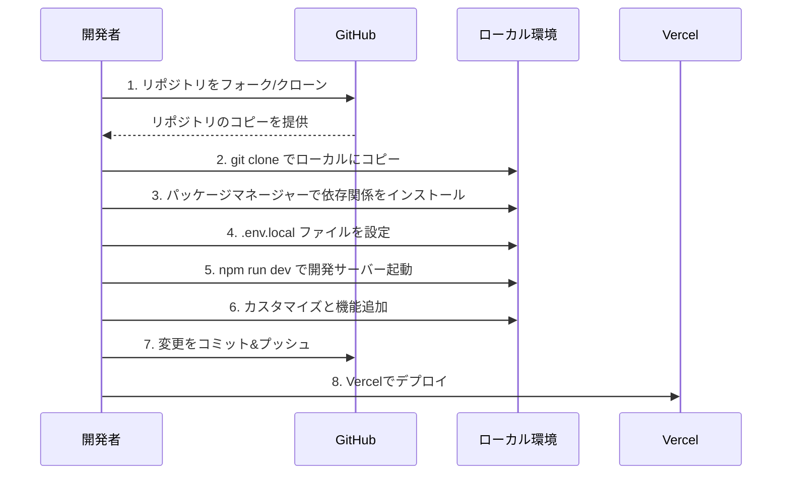

# ポートフォリオサイト

# 目次

- [1. プロジェクト概要](#1-プロジェクト概要)
  - [プロジェクト構造の詳細説明](#プロジェクト構造の詳細説明)
- [2. 技術スタック](#2-技術スタック)
  - [フロントエンド](#フロントエンド)
  - [バックエンド](#バックエンド)
  - [開発ツール](#開発ツール)
  - [パフォーマンス最適化](#パフォーマンス最適化)
- [3. 主な機能](#3-主な機能)
- [4. パフォーマンス最適化](#4-パフォーマンス最適化)
  - [1. サーバーコンポーネントとデータフェッチングの最適化](#1-サーバーコンポーネントとデータフェッチングの最適化)
  - [2. 高度な画像最適化](#2-高度な画像最適化)
  - [3. 多層キャッシュ戦略](#3-多層キャッシュ戦略)
  - [4. SEOとWebバイタルの最適化](#4-seoとwebバイタルの最適化)
  - [5. PWA対応の強化](#5-pwa対応の強化)
  - [6. コード最適化](#6-コード最適化)
  - [7. コンポーネント読み込みの最適化](#7-コンポーネント読み込みの最適化)
  - [8. 国際化とフォント最適化](#8-国際化とフォント最適化)
- [5. 初期セットアップ](#5-初期セットアップ)
  - [必要条件](#必要条件)
  - [インストール手順](#インストール手順)
  - [環境変数の設定](#環境変数の設定)
  - [開発ワークフロー](#開発ワークフロー)
  - [使用可能なスクリプト](#使用可能なスクリプト)
  - [トラブルシューティング](#トラブルシューティング)
  - [Vercelへのデプロイ方法](#vercelへのデプロイ方法)
  - [自動デプロイ](#自動デプロイ)
- [6. ダッシュボードAPIとの連携](#6-ダッシュボードapiとの連携)
  - [環境変数の設定](#環境変数の設定-1)
  - [データフェッチングの実装](#データフェッチングの実装)
    - [1. サーバーサイドでのデータフェッチング](#1-サーバーサイドでのデータフェッチング)
    - [2. クライアントサイドでのデータフェッチング](#2-クライアントサイドでのデータフェッチング)
  - [キャッシュ戦略](#キャッシュ戦略)
  - [フォールバックとエラーハンドリング](#フォールバックとエラーハンドリング)
  - [APIキーの取得方法](#apiキーの取得方法)
  - [セキュリティに関する注意事項](#セキュリティに関する注意事項)
  - [トラブルシューティング](#トラブルシューティング-1)
- [7. Git管理とコード品質](#7-git管理とコード品質)
  - [ブランチ戦略](#ブランチ戦略)
  - [コミットメッセージ規約](#コミットメッセージ規約)
    - [コミットタイプ](#コミットタイプ)
  - [コード品質管理](#コード品質管理)
- [8. 初心者向けガイド](#8-初心者向けガイド)
  - [プロジェクト開始フロー](#プロジェクト開始フロー)
  - [カスタマイズの基本手順](#カスタマイズの基本手順)
  - [プロジェクトの追加と編集](#プロジェクトの追加と編集)
  - [新しいセクションの追加](#新しいセクションの追加)
  - [画像とアセット](#画像とアセット)
  - [その他のカスタマイズポイント](#その他のカスタマイズポイント)
  - [よくある質問と回答](#よくある質問と回答)
  - [開発のヒントとコツ](#開発のヒントとコツ)
- [9. トラブルシューティング](#9-トラブルシューティング)
  - [セキュリティのベストプラクティス](#セキュリティのベストプラクティス)
  - [よくある問題と解決方法](#よくある問題と解決方法)
- [10. コンタクトフォーム設定](#10-コンタクトフォーム設定)
  - [基本セットアップ](#基本セットアップ)
  - [実装の詳細](#実装の詳細)
  - [高度なカスタマイズオプション](#高度なカスタマイズオプション)
- [11. セキュリティガイドライン](#11-セキュリティガイドライン)
  - [環境変数の管理](#環境変数の管理)
  - [セキュリティヘッダーの設定](#セキュリティヘッダーの設定)
  - [API保護とレート制限](#api保護とレート制限)
  - [依存関係の管理](#依存関係の管理)
  - [入力値検証とサニタイゼーション](#入力値検証とサニタイゼーション)
  - [CORS設定](#cors設定)
  - [セキュリティチェックリスト](#セキュリティチェックリスト)
  - [監視とロギング](#監視とロギング)
  - [インシデント対応](#インシデント対応)
- [ライセンス](#ライセンス)

## 1. プロジェクト概要

Next.js、TypeScript、Tailwind CSS を使用したモダンなポートフォリオサイトです。ダークモード対応とレスポンシブデザインを実装しています。

### プロジェクト構造の詳細説明

```
.
├── app/                     # Next.js App Router
│   ├── api/                # API Routes
│   │   ├── apps/          # アプリ関連API
│   │   ├── contact/       # コンタクトフォームAPI
│   │   ├── portfolio/     # ポートフォリオデータAPI
│   │   └── proxy/         # プロキシAPI
│   ├── projects/          # プロジェクト詳細ページ
│   ├── globals.css        # グローバルスタイル
│   ├── layout.tsx         # ルートレイアウト
│   ├── manifest.ts        # PWAマニフェスト設定
│   ├── page.tsx           # ホームページ
│   ├── providers.tsx      # Reactプロバイダー
│   ├── robots.ts          # ロボットファイル設定
│   └── sitemap.ts         # サイトマップ生成
│
├── components/             # UIコンポーネント
│   ├── About.tsx          # 自己紹介セクション
│   ├── Button.tsx         # ボタンコンポーネント
│   ├── Card.tsx           # カードコンポーネント
│   ├── ClientHero.tsx     # ヒーローセクション（クライアント）
│   ├── ClientProjects.tsx # プロジェクト一覧（クライアント）
│   ├── Contact.tsx        # コンタクトフォーム
│   ├── Footer.tsx         # フッター
│   ├── Header.tsx         # ヘッダー
│   ├── Hero.tsx           # ヒーローセクション（サーバー）
│   ├── Input.tsx          # インプットコンポーネント
│   ├── Label.tsx          # ラベルコンポーネント
│   ├── ProjectCard.tsx    # プロジェクトカード
│   ├── ProjectGrid.tsx    # プロジェクトグリッド
│   ├── Projects.tsx       # プロジェクトセクション（サーバー）
│   ├── Separator.tsx      # セパレーターコンポーネント
│   ├── Skills.tsx         # スキルセクション
│   └── ThemeToggle.tsx    # テーマ切替ボタン
│
├── context/                # Reactコンテキスト
│   └── ThemeContext.tsx   # テーマ管理（ダークモード）
│
├── docs/                   # ドキュメント関連ファイル
│
├── lib/                    # ユーティリティ関数とデータ
│   ├── api/               # APIクライアント関数
│   ├── hooks/             # カスタムReactフック
│   ├── middleware/        # ミドルウェア関数
│   ├── utils/             # ユーティリティ関数
│   ├── validation/        # バリデーション関数
│   ├── projects.ts        # プロジェクトデータ
│   ├── skills.ts          # スキルデータ
│   └── stats.ts           # 統計データ
│
├── public/                 # 静的ファイル
│   ├── icons/             # アイコンファイル
│   ├── images/            # 画像ファイル
│   ├── favicon.ico        # ファビコン
│   ├── favicon.png        # PNGファビコン
│   └── icon-192.png       # PWAアイコン
│
├── scripts/                # ビルド/デプロイスクリプト
│
├── types/                  # TypeScript型定義
│
├── .env.example           # 環境変数サンプル
├── .env.local             # ローカル環境変数（非公開）
├── .env.development.local # 開発環境変数（非公開）
├── .eslintrc.json         # ESLint設定
├── .gitignore             # Git除外設定
├── .prettierrc            # Prettier設定
├── environment.d.ts       # 環境変数型定義
├── next-env.d.ts          # Next.js型定義
├── next.config.js         # Next.js設定
├── package-lock.json      # パッケージロック
├── package.json           # パッケージ情報
├── postcss.config.js      # PostCSS設定
├── tailwind.config.js     # Tailwind CSS設定
└── tsconfig.json          # TypeScript設定
```

## 2. 技術スタック

### フロントエンド

- **Next.js** (v14.1.0) - Reactベースのフレームワーク
  - App Router採用
  - サーバーコンポーネント（RSC）
  - サーバーサイドレンダリング (SSR)
  - 画像最適化（AVIF、WebP対応）
  - i18n対応（日本語）
- **React** (v18.2.0) - UIライブラリ
- **TypeScript** (v5.3.3) - 型安全なJavaScript
- **Tailwind CSS** (v3.4.1) - ユーティリティファーストのCSSフレームワーク
  - カスタムアニメーション
  - ダークモード対応
- **React Query** (Tanstack Query v5.66.9) - サーバー状態管理
- **Radix UI Icons** (v1.3.2) - アクセシブルなアイコンセット

### バックエンド

- **Next.js API Routes** - サーバーレスAPI
- **SendGrid** (v7.7.0) - メール送信サービス
- **LRU Cache** (v10.4.3) - サーバーサイドキャッシュ
- **Vercel Blob Storage** - 画像およびファイルストレージ

### 開発ツール

- **ESLint** (v8.56.0) - コード品質管理
  - TypeScript ESLint (v7.0.2)
  - ESLint Config Next (v14.1.0)
  - ESLint Config Prettier (v9.1.0)
- **Prettier** (v3.2.5) - コードフォーマッター
- **PostCSS** (v8.4.35) - CSSプロセッサー
  - Autoprefixer (v10.4.17)
- **Sharp** (v0.33.5) - 画像最適化
- **SWC** - 高速JavaScript/TypeScriptコンパイラ

### パフォーマンス最適化

- **静的アセットの圧縮**
- **画像最適化と遅延読み込み**
- **パッケージインポートの最適化**
- **キャッシュ戦略**
- **SWCによるミニファイ**

## 3. 主な機能

1. **モダンなレスポンシブデザイン**

   - モバイル、タブレット、デスクトップ対応（フレキシブルレイアウト）
   - アニメーション効果とインタラクション
   - グラデーションと背景エフェクト
   - カスタムUIコンポーネント

2. **ダークモード対応**

   - システム設定との自動連動
   - 手動切り替え機能（ThemeToggle）
   - ローカルストレージでの設定保存
   - テーマ別のカラースキーム最適化

3. **プロジェクトギャラリー**

   - Next.js Server ComponentsとClient Components併用
   - React Query によるデータフェッチングと状態管理
   - カスタムプロジェクトカード
   - 詳細ページ（[slug]ベースの動的ルーティング）
   - プロジェクト統計情報の自動計算

4. **パフォーマンス最適化**

   - サーバーサイドレンダリング（SSR）
   - 画像最適化（AVIF、WebP対応）
   - React Suspenseによるローディング状態管理
   - キャッシュ戦略（TTLベース）
   - コード分割とレイジーローディング

5. **セキュアなコンタクトフォーム**

   - 入力バリデーション
   - 送信状態管理
   - エラーハンドリング
   - SendGrid API連携
   - CSRF保護

6. **SEO対策**

   - サイトマップ自動生成（sitemap.ts）
   - ロボットファイル設定（robots.ts）
   - メタデータ最適化
   - Open Graph対応
   - セマンティックHTML構造

7. **PWA対応**

   - マニフェストファイル（manifest.ts）
   - アイコンセット（複数サイズ対応）
   - オフライン対応
   - インストール可能
   - テーマカラー設定

8. **アクセシビリティ**

   - セマンティックHTML
   - キーボードナビゲーション
   - スクリーンリーダー対応
   - カラーコントラスト最適化
   - アクセシブルなフォーム

## 4. パフォーマンス最適化

プロジェクトでは、Next.jsとVercel環境を最大限に活用して表示速度とユーザー体験を向上させるための多層的な最適化を実施しています。

### 1. サーバーコンポーネントとデータフェッチングの最適化

- **React Server Components**: データフェッチングをサーバーサイドに移動し、クライアントへの初期ロード時間を短縮
- **Next.js Cache API**: `unstable_cache`を使用して、サーバーサイドでのデータフェッチング結果を効率的にキャッシュ
- **Suspense**: ストリーミングHTMLとプログレッシブハイドレーションによるUXの向上

```tsx
// サーバーコンポーネントの例
export default async function Hero() {
  // サーバーサイドでデータを取得
  const stats = await getStats();
  // クライアントコンポーネントにデータを渡す
  return <ClientHero initialStats={stats} />;
}
```

### 2. 高度な画像最適化

- **Next.js Image Optimization**: 自動的な画像フォーマット変換（WebP、AVIF）
- **レスポンシブ画像**: デバイスサイズに応じた最適な画像サイズの提供
- **カスタムデバイスサイズ**: 最適化されたデバイスサイズブレークポイントの設定
- **遅延読み込み**: 画面外の画像は必要になるまで読み込まない
- **キャッシュコントロール**: 画像に対して24時間の最小キャッシュTTL

```javascript
// next.config.jsでの設定
images: {
  formats: ['image/avif', 'image/webp'],
  deviceSizes: [640, 750, 828, 1080, 1200, 1920, 2048],
  imageSizes: [16, 32, 48, 64, 96, 128, 256, 384],
  minimumCacheTTL: 86400, // 24時間のキャッシュ
}
```

### 3. 多層キャッシュ戦略

- **サーバーサイドキャッシュ**: Next.jsの`unstable_cache`で1時間のTTLと自動再検証
- **クライアントサイドメモリキャッシュ**: 同一セッション内での重複リクエストを30分間防止
- **HTTPキャッシュヘッダー**: 静的アセット用の最適化されたキャッシュヘッダー
- **コンポーネントレベルのキャッシング**: Reactメモ化と効率的な状態管理

```typescript
// lib/api/server.tsでのサーバーサイドキャッシュ実装
export const getProjects = unstable_cache(
  async () => {
    // データフェッチングロジック
  },
  ['projects-data'],
  { revalidate: 3600 } // 1時間ごとに再検証
);
```

### 4. SEOとWebバイタルの最適化

- **動的サイトマップ生成**: 静的・動的ルートを含む自動生成されたサイトマップ
- **Robots.txt制御**: クローラーの動作を最適化するカスタム設定
- **レスポンシブメタデータ**: デバイス適応型メタデータとビューポート設定
- **コアWebバイタル**: LCP、FID、CLSなどのメトリクスを改善する最適化

### 5. PWA対応の強化

- **最適化されたマニフェスト**: 完全な機能を備えたPWAマニフェスト
- **適応型テーマカラー**: ライト/ダークモードに対応した異なるテーマカラー
- **複数サイズのアイコン**: あらゆるデバイスとコンテキストに対応
- **効率的なオフラインサポート**: サービスワーカーとキャッシュ戦略

### 6. コード最適化

- **パッケージインポート最適化**: `optimizePackageImports`による効率的なインポート
- **SWCミニファイ**: Terserより高速な代替ミニファイ処理
- **不要なソースマップ除去**: 本番環境でのブラウザソースマップを無効化
- **アセット圧縮**: すべての配信アセットに対する効率的な圧縮
- **Strictモード**: 本番環境での信頼性向上

```javascript
// next.config.jsでの設定
const nextConfig = {
  experimental: {
    optimizePackageImports: ['@radix-ui/react-icons'],
  },
  compress: true,
  productionBrowserSourceMaps: false,
  reactStrictMode: process.env.NODE_ENV === 'production',
  swcMinify: true,
};
```

### 7. コンポーネント読み込みの最適化

- **戦略的Suspense**: 知覚されるローディング時間を改善するSuspenseの使用
- **スケルトンUI**: コンポーネント読み込み中のカスタムフォールバックUI
- **ページレベルの再検証**: 効率的なデータ鮮度の管理

```tsx
// app/page.tsxでの実装
export const revalidate = 3600; // 1時間のページ再検証

export default function Home() {
  return (
    <main>
      <Suspense fallback={<LoadingSkeleton />}>
        <Hero />
      </Suspense>
      {/* 他のコンポーネント */}
    </main>
  );
}
```

### 8. 国際化とフォント最適化

- **効率的なi18n**: 日本語をデフォルトとした最適化された国際化設定
- **Next.jsフォントシステム**: サブセット対応のフォント読み込み
- **フォントディスプレイ制御**: フォント読み込み中のテキスト表示を最適化

これらの最適化を組み合わせることで、デバイス間で優れたユーザーエクスペリエンスを提供し、SEO特性と開発者体験を維持する高パフォーマンスなポートフォリオサイトを実現しています。

## 5. 初期セットアップ

### 必要条件

- **Node.js** 18.x 以上（Next.js 14の要件に合わせて）
- **npm** 9.x 以上または**yarn** 1.22.x 以上または**pnpm** 8.x 以上
- **Git** 2.x 以上

### インストール手順

```bash
# 1. リポジトリのクローン
git clone https://github.com/wit-maker/portfolio.git

# 2. プロジェクトディレクトリに移動
cd portfolio

# 3. 依存関係のインストール
npm install
# または
yarn install
# または
pnpm install

# 4. 環境変数の設定
cp .env.example .env.local
# .env.localファイルを編集し、必要な環境変数を設定

# 5. ファビコンの生成（オプション）
node scripts/generate-favicon.js

# 6. 開発サーバーの起動
npm run dev
# または
yarn dev
# または
pnpm dev
```

### 環境変数の設定

環境変数は`.env.local`ファイルに設定します。必要な環境変数は以下の通りです：

```env
# ダッシュボードAPIのベースURL
NEXT_PUBLIC_API_BASE_URL=http://localhost:3000
# 本番環境では実際のAPIドメインに変更

# ダッシュボードAPIの認証キー
NEXT_PUBLIC_DASHBOARD_API_KEY=your_api_key_here

# SendGrid APIキー（メール送信用）
SENDGRID_API_KEY=your_sendgrid_api_key

# コンタクトフォームのメール設定
CONTACT_FORM_TO_EMAIL=recipient@example.com
CONTACT_FORM_FROM_EMAIL=noreply@example.com
```

### 開発ワークフロー

1. **コードの変更**: ソースコードを編集します
2. **リンターの実行**: `npm run lint`で構文とコードスタイルをチェック
3. **開発サーバー**: `npm run dev`で開発サーバーを起動（http://localhost:3000）
4. **ビルドテスト**: `npm run build`で本番用ビルドをテスト
5. **コミット**: 変更をコミットする前に必ずエラーとリンター警告を修正

### 使用可能なスクリプト

| コマンド        | 説明                                     |
| --------------- | ---------------------------------------- |
| `npm run dev`   | 開発サーバーを起動（ホットリロード対応） |
| `npm run build` | 本番用にアプリケーションをビルド         |
| `npm run start` | ビルドしたアプリケーションを起動         |
| `npm run lint`  | コードリンティングを実行                 |

### トラブルシューティング

開発環境のセットアップ時に問題が発生した場合：

1. **Node.jsのバージョン確認**: `node -v`で18.x以上か確認
2. **依存関係の削除と再インストール**: `rm -rf node_modules && npm install`
3. **.next/ キャッシュのクリア**: `rm -rf .next`（キャッシュ関連の問題解決に有効）
4. **環境変数の設定確認**: `.env.local`ファイルが正しく設定されているか確認

### Vercelへのデプロイ方法

1. **Vercelアカウントの作成**

   - [Vercel](https://vercel.com)にアクセス
   - GitHubアカウントでサインアップ

2. **プロジェクトのインポート**

   - New Projectボタンをクリック
   - GitHubリポジトリを選択

3. **環境変数の設定**

   - Settings > Environment Variables
   - `.env.local`の内容を追加

4. **デプロイ設定**

   - Framework Preset: Next.js
   - Build Command: `next build`
   - Output Directory: `.next`

5. **デプロイの実行**

   - Deployボタンをクリック
   - ビルドログを確認

6. **ドメイン設定（オプション）**
   - Settings > Domains
   - カスタムドメインの追加と設定

### 自動デプロイ

- mainブランチへのプッシュで自動デプロイ
- プレビューデプロイ（PR作成時）
- 環境ごとのデプロイ（本番/開発）

## 6. ダッシュボードAPIとの連携

このポートフォリオサイトは、外部ダッシュボードAPIからプロジェクトデータを取得して表示します。APIとの連携は、クライアントサイドとサーバーサイドの両方で実装されています。

### 環境変数の設定

以下の環境変数を設定する必要があります：

1. **開発環境用** (`.env.local`ファイル)：

```
# ダッシュボードAPIのベースURL
NEXT_PUBLIC_API_BASE_URL=https://your-dashboard-api.vercel.app

# ダッシュボードAPIのアクセスキー
NEXT_PUBLIC_API_KEY=your_api_key_here

# バックエンド用APIキー（開発環境のみ必要）
NEXT_PUBLIC_DASHBOARD_API_KEY=your_dashboard_api_key
```

2. **本番環境用** (Vercel環境変数)：

Vercelダッシュボードで以下の環境変数を設定します：

- `NEXT_PUBLIC_API_BASE_URL`: ダッシュボードAPIのURL
- `NEXT_PUBLIC_API_KEY`: ダッシュボードAPIのアクセスキー
- `NEXT_PUBLIC_DASHBOARD_API_KEY`: バックエンド用APIキー

### データフェッチングの実装

#### 1. サーバーサイドでのデータフェッチング

サーバーコンポーネント内でAPIからデータを取得する場合は、`lib/api/server.ts`の関数を使用します：

```tsx
// サーバーコンポーネントの例（components/Projects.tsx）
import { getProjects } from '@/lib/api/server';

export default async function Projects() {
  // サーバーサイドでデータを取得（Next.jsのキャッシュ機能を活用）
  const projects = await getProjects();

  // クライアントコンポーネントにデータを渡す
  return <ClientProjects initialProjects={projects} />;
}
```

#### 2. クライアントサイドでのデータフェッチング

クライアントコンポーネント内でAPIからデータを取得する場合は、カスタムフックを使用します：

```tsx
// クライアントコンポーネントの例
import { useApps } from '@/lib/hooks/useApps';

export default function ClientProjects() {
  const { projects, isLoading, error } = useApps();

  if (isLoading) return <div>Loading...</div>;
  if (error) return <div>Error: {error.message}</div>;

  return (
    <div>
      {projects.map((project) => (
        <ProjectCard key={project.id} project={project} />
      ))}
    </div>
  );
}
```

### キャッシュ戦略

データフェッチングには以下のキャッシュ戦略が実装されています：

1. **サーバーサイド**：Next.jsの`unstable_cache`を使用して、サーバーサイドでのデータフェッチング結果をキャッシュします（TTL: 1時間）
2. **クライアントサイド**：メモリ内キャッシュを使用して、同一セッション内での重複リクエストを防止します（TTL: 30分）

### フォールバックとエラーハンドリング

APIが利用できない場合や環境変数が設定されていない場合は、モックデータが使用されます：

1. 開発環境では、環境変数が設定されていない場合に警告が表示されます
2. APIリクエストが失敗した場合、エラーログが出力され、モックデータが表示されます
3. 本番環境では、環境変数が設定されていない場合にエラーが表示されます

### APIキーの取得方法

1. ダッシュボード管理画面にログインします
2. 「設定」→「API設定」に移動します
3. 「新しいAPIキーを生成」ボタンをクリックします
4. APIキーの名前と権限を設定し、「生成」をクリックします
5. 生成されたAPIキーをコピーして環境変数に設定します

### セキュリティに関する注意事項

- APIキーは機密情報です。GitHubなどの公開リポジトリにコミットしない
- `NEXT_PUBLIC_`接頭辞の付いた環境変数はクライアントサイドで参照可能なため、完全に安全ではありません
- より高いセキュリティが必要な場合は、サーバーサイドでのみAPIリクエストを行い、クライアントには必要最小限のデータのみを渡すことを検討してください
- 本番環境では、Vercelの環境変数暗号化機能を活用してAPIキーを保護することをお勧めします

### トラブルシューティング

1. **APIからデータが取得できない場合**

   - 環境変数が正しく設定されているか確認してください
   - APIキーが有効か確認してください
   - ネットワーク接続を確認してください
   - ダッシュボードAPIが稼働しているか確認してください

2. **モックデータが表示される場合**

   - 環境変数が正しく設定されているか確認してください
   - APIリクエストのエラーログを確認してください
   - ダッシュボードAPIのエンドポイントが正しいか確認してください

3. **APIキーの更新が必要な場合**
   - ダッシュボード管理画面で新しいAPIキーを生成してください
   - 古いAPIキーを無効化してください
   - 環境変数を更新してください

## 7. Git管理とコード品質

### ブランチ戦略

- `main`: プロダクション環境用
- `develop`: 開発環境用
- `feature/*`: 機能開発用
- `fix/*`: バグ修正用
- `hotfix/*`: 緊急バグ修正用

### コミットメッセージ規約

```
<type>: <description>

[optional body]
[optional footer]
```

#### コミットタイプ

- `feat`: 新機能
- `fix`: バグ修正
- `docs`: ドキュメント更新
- `style`: コードスタイル修正
- `refactor`: リファクタリング
- `test`: テスト関連
- `chore`: ビルド・補助ツール関連

### コード品質管理

- ESLint: コード品質チェック
- Prettier: コードフォーマット
- TypeScript: 型チェック

## 8. 初心者向けガイド

### プロジェクト開始フロー



### カスタマイズの基本手順

1. **プロジェクト情報の更新**

   ```bash
   # 1. package.json でプロジェクト名とバージョンを変更
   {
     "name": "your-portfolio-name",
     "version": "1.0.0",
     ...
   }

   # 2. app/layout.tsx でメタデータを更新
   export const metadata: Metadata = {
     title: {
       template: '%s | あなたのサイト名',
       default: 'あなたのサイト名 | Developer Portfolio',
     },
     description: 'あなたのサイトの説明文をここに記述します。',
     // ...
   };
   ```

2. **テーマカラーのカスタマイズ**

   ```css
   /* app/globals.css でテーマカラーを変更 */
   :root {
     --primary: #あなたのメインカラー; /* 現在: #c5a572 (ゴールド) */
     --secondary: #あなたのサブカラー; /* 現在: #2c3e50 (ダークブルー) */
     --accent: #あなたのアクセントカラー;
     --background: #ffffff;
     --text: #333333;
   }

   .dark {
     --primary: #あなたのダークモードメインカラー;
     --secondary: #あなたのダークモードサブカラー;
     --accent: #あなたのダークモードアクセントカラー;
     --background: #1a1a1a;
     --text: #ffffff;
   }
   ```

3. **プロフィール情報の更新**

   ```tsx
   // components/About.tsx を編集
   const About: React.FC = () => {
     return (
       <div className="w-full bg-white dark:bg-gray-800 py-16">
         <div className="max-w-4xl mx-auto px-4">
           <Card className="bg-card">
             {/* ... */}
             <CardContent className="bg-card">
               <div className="flex flex-col md:flex-row gap-8">
                 <div className="md:w-1/3">
                   <div className="relative w-32 h-32 mx-auto mb-4">
                     <Image
                       src="/images/あなたのプロフィール画像.png" // ここを変更
                       alt="プロフィール画像"
                       width={128}
                       height={128}
                       priority
                       className="rounded-full object-cover"
                     />
                   </div>
                 </div>
                 <div className="md:w-2/3">
                   {/* ここにプロフィール情報を追加 */}
                   <h3 className="text-xl font-semibold mb-4">経歴</h3>
                   <p className="mb-4">あなたの経歴や自己紹介を記述します。</p>
                   {/* SNSリンクなどの更新 */}
                   <div className="flex gap-4">
                     <a href="https://x.com/あなたのアカウント">X (Twitter)</a>
                     <a href="https://github.com/あなたのアカウント">GitHub</a>
                   </div>
                 </div>
               </div>
             </CardContent>
           </Card>
         </div>
       </div>
     );
   };
   ```

### プロジェクトの追加と編集

1. **プロジェクト画像の追加**

   ```bash
   # 1. プロジェクトのスクリーンショット/画像を準備
   # 2. public/images/ ディレクトリに画像を追加
   # 3. 推奨サイズ: 1200x630px (アスペクト比16:9)
   # 4. ファイル形式: JPG または PNG
   ```

2. **プロジェクトデータの追加**

   ```typescript
   // lib/projects.ts を編集
   export const projects: Project[] = [
     // 既存のプロジェクト

     // 新しいプロジェクトを追加
     {
       id: 2, // 一意のID（連番）
       title: 'あなたのプロジェクト名',
       description:
         'プロジェクトの詳細な説明。SEOにも影響するので具体的に書くことをお勧めします。',
       image: '/images/your-project-image.png', // 上記で追加した画像パス
       techStack: ['Next.js', 'TypeScript', 'Tailwind CSS'], // 使用技術
       githubUrl: 'https://github.com/username/repository', // GitHubリポジトリURL
       demoUrl: 'https://your-demo-site.com', // デモサイトURL
       slug: 'your-project-slug', // URLに使用される識別子（一意、英数字とハイフンのみ）
     },
   ];
   ```

3. **スキルデータの更新**

   ```typescript
   // lib/skills.ts を編集
   export const skills: Skill[] = [
     // スキルを追加/編集
     { name: 'React', level: 90, category: 'Frontend' },
     { name: 'TypeScript', level: 85, category: 'Language' },
     { name: 'Node.js', level: 80, category: 'Backend' },
     { name: 'Next.js', level: 85, category: 'Frontend' },
     // level: 習熟度を表す数値 (0-100)
     // category: スキルのカテゴリ（表示とフィルタリングに使用）
   ];
   ```

### 新しいセクションの追加

1. **コンポーネントの作成**

   ```tsx
   // components/NewSection.tsx を作成
   import React from 'react';
   import Card, { CardHeader, CardTitle, CardContent } from './Card';

   const NewSection: React.FC = () => {
     return (
       <div className="w-full bg-white dark:bg-gray-800 py-16">
         <div className="max-w-4xl mx-auto px-4">
           <Card>
             <CardHeader>
               <CardTitle>新しいセクション</CardTitle>
             </CardHeader>
             <CardContent>
               {/* セクションの内容 */}
               <p>ここに新しいセクションの内容を記述します。</p>
             </CardContent>
           </Card>
         </div>
       </div>
     );
   };

   export default NewSection;
   ```

2. **ページへの追加**

   ```tsx
   // app/page.tsx に新しいセクションを追加
   import NewSection from '@/components/NewSection';

   export default function Home() {
     return (
       <main>
         <Suspense fallback={<div>Loading...</div>}>
           <Hero />
         </Suspense>

         {/* 既存のセクション */}
         <Projects />

         {/* 新しいセクションを追加 */}
         <NewSection />
       </main>
     );
   }
   ```

### 画像とアセット

1. **プロフィール画像の変更**

   ```bash
   # 1. あなたのプロフィール画像を準備（推奨: 正方形、最低256x256px）
   # 2. public/images/profile.png として保存（既存ファイルを置き換え）
   ```

2. **アイコンの変更**

   ```bash
   # ファビコンの生成
   node scripts/generate-favicon.js

   # または、カスタムのファビコンを準備して以下に配置:
   # - public/favicon.ico
   # - public/favicon.png
   # - public/icons/icon-192.png
   # - public/icons/icon-512.png
   # - public/icons/apple-icon.png
   ```

### その他のカスタマイズポイント

1. **フォントの変更**

   ```tsx
   // app/layout.tsx でフォントを変更
   import { Inter, Noto_Sans_JP, Roboto } from 'next/font/google';

   // フォントの定義（例: Noto Sans JPを使用）
   const notoSansJP = Noto_Sans_JP({
     weight: ['400', '500', '700'],
     subsets: ['latin'],
     display: 'swap',
   });

   // レイアウトコンポーネントでフォントクラスを適用
   export default function RootLayout({
     children,
   }: {
     children: React.ReactNode;
   }) {
     return (
       <html lang="ja" suppressHydrationWarning>
         <head>{/* その他のhead要素 */}</head>
         <body className={notoSansJP.className}>{/* ... */}</body>
       </html>
     );
   }
   ```

2. **レスポンシブデザインの調整**

   ```css
   /* Tailwind CSSのブレークポイント
    * sm: 640px以上
    * md: 768px以上
    * lg: 1024px以上
    * xl: 1280px以上
    * 2xl: 1536px以上
    */

   /* たとえば、以下のようにしてブレークポイントごとにスタイルを適用 */
   <div className="w-full sm:w-1/2 md:w-1/3 lg:w-1/4 p-4">
     {/* コンテンツ */}
   </div>
   ```

3. **アニメーションの追加**

   ```css
   /* app/globals.css に新しいアニメーションを追加 */
   @keyframes fadeIn {
     from {
       opacity: 0;
     }
     to {
       opacity: 1;
     }
   }

   .fade-in {
     animation: fadeIn 1s ease-in-out;
   }
   ```

### よくある質問と回答

1. **Q: 公開前にチェックすべき項目は？**

   **A:** 以下の点を確認してください：

   - すべてのリンクが正しく機能するか
   - 画像が適切に表示されるか
   - レスポンシブデザインが各デバイスで正しく表示されるか
   - ダークモードが正しく機能するか
   - Lighthouse等でパフォーマンスとアクセシビリティをチェック

2. **Q: カスタムドメインを設定するには？**

   **A:** Vercelでデプロイ後、以下の手順で設定します：

   1. Vercelダッシュボードでプロジェクトを選択
   2. "Settings" > "Domains"に移動
   3. カスタムドメインを追加
   4. DNSプロバイダでVercelのネームサーバーまたはCNAME/Aレコードを設定

3. **Q: アナリティクスを追加するには？**

   **A:** Google Analytics等を追加する場合は、app/layout.tsxのhead部分にスクリプトを追加します。ただし、Next.jsのScript componentを利用することをお勧めします：

   ```tsx
   import Script from 'next/script';

   export default function RootLayout({
     children,
   }: {
     children: React.ReactNode;
   }) {
     return (
       <html lang="ja">
         <head>{/* その他のhead要素 */}</head>
         <body>
           {children}

           {/* Google Analytics */}
           <Script
             strategy="afterInteractive"
             src={`https://www.googletagmanager.com/gtag/js?id=G-XXXXXXXXXX`}
           />
           <Script id="google-analytics" strategy="afterInteractive">
             {`
               window.dataLayer = window.dataLayer || [];
               function gtag(){dataLayer.push(arguments);}
               gtag('js', new Date());
               gtag('config', 'G-XXXXXXXXXX');
             `}
           </Script>
         </body>
       </html>
     );
   }
   ```

### 開発のヒントとコツ

1. **コンポーネントの分割**

   機能やUIをできるだけ小さく再利用可能なコンポーネントに分割しましょう。これにより、保守性と再利用性が向上します。

2. **型の活用**

   TypeScriptの型を積極的に活用し、`any`型の使用を避けましょう。これにより、バグの早期発見と開発効率の向上につながります。

3. **パフォーマンス最適化**

   - 画像は`next/image`を使用して最適化
   - コンポーネントの不必要な再レンダリングを防ぐためにメモ化を活用
   - 大きなデータや計算結果はキャッシュを活用

4. **アクセシビリティを忘れずに**

   - 適切なHTML構造（見出しレベルなど）を使用
   - キーボードナビゲーションのサポート
   - 適切なalt属性や aria-\* 属性の使用

5. **プログレッシブエンハンスメント**

   基本機能を確実に動作させた上で、JavaScriptが有効な場合に拡張機能を提供する設計を心がけましょう。

## 9. トラブルシューティング

1. **SendGridエラー**:

   - APIキーが正しく設定されているか確認
   - 送信元メールアドレスが認証されているか確認
   - SendGridダッシュボードでアカウントステータスを確認

2. **メールが届かない**:

   - スパムフォルダを確認
   - 環境変数の設定を確認（`CONTACT_FORM_TO_EMAIL`, `CONTACT_FORM_FROM_EMAIL`）
   - エラーログを確認して原因を特定

3. **レート制限エラー**:
   - 短時間に多数のリクエストを送信していないか確認
   - テスト環境では一時的にレート制限を緩和することも検討
   - 実際のユースケースに合わせてレート制限値を調整

### セキュリティのベストプラクティス

1. **APIキーの保護**:

   - APIキーを公開リポジトリにコミットしない
   - Vercelの環境変数暗号化機能を利用

2. **入力検証**:

   - すべてのユーザー入力を厳格に検証
   - 入力値の長さ制限を設定
   - 特殊文字やHTMLタグをエスケープ処理

3. **エラーメッセージ**:

   - 詳細なエラー情報を公開しない
   - ユーザー向けエラーメッセージを一般化

4. **レート制限**:

   - 同一IPからの過剰なリクエストを制限
   - 短時間での多数の試行を検知して制限

5. **ログ記録**:

   - 不審なアクティビティを記録
   - 個人情報を含むログは暗号化または最小限に保持

6. **脆弱性管理**:
   - 依存パッケージを定期的に更新
   - セキュリティ脆弱性の報告があれば即座に対応

### よくある問題と解決方法

1. **環境変数が読み込めない**

   - `.env.local`ファイルの存在確認
   - 変数名の確認（NEXT*PUBLIC*接頭辞）
   - サーバー再起動

2. **画像が表示されない**

   - `public/images/`ディレクトリの確認
   - Next.js Image componentの設定確認
   - ファイル名とパスの確認

3. **APIエラー**

   - 環境変数の設定確認
   - APIキーの有効性確認
   - ネットワーク接続確認

4. **ビルドエラー**
   - 依存関係の更新: `npm install`
   - キャッシュのクリア: `npm run clean`
   - TypeScriptエラーの修正

## 10. コンタクトフォーム設定

このポートフォリオサイトには、訪問者がサイトオーナーに直接連絡できるコンタクトフォームが組み込まれています。Next.js API RoutesとSendGridを使用して実装されています。

### 基本セットアップ

1. **SendGridアカウントの準備**:

   - [SendGrid](https://sendgrid.com/)でアカウントを作成します
   - APIキーを発行し、送信元メールアドレスを認証します

2. **環境変数の設定**:

   ```env
   # SendGrid APIキー
   SENDGRID_API_KEY=your_sendgrid_api_key

   # コンタクトフォームのメール設定
   CONTACT_FORM_TO_EMAIL=recipient@example.com  # 受信用メールアドレス
   CONTACT_FORM_FROM_EMAIL=noreply@example.com  # 送信元メールアドレス
   ```

3. **動作確認**:
   - 開発サーバーを起動: `npm run dev`
   - コンタクトフォームを開き、テストメッセージを送信
   - 指定した受信用メールアドレスでメールを受信できることを確認

### 実装の詳細

1. **フロントエンドコンポーネント (`components/Contact.tsx`)**:

   - Reactフォームコンポーネント
   - 入力値の状態管理
   - フォーム送信処理
   - 送信状態の表示（成功/エラーメッセージ）

2. **APIエンドポイント (`app/api/contact/route.ts`)**:

   - Next.js API Routes（App Router形式）
   - SendGridライブラリとの連携
   - 入力検証と処理
   - エラーハンドリング

3. **入力検証 (`lib/utils/validation.ts`)**:

   - 名前、メールアドレス、メッセージの検証
   - サニタイズ処理（XSS対策）

4. **セキュリティ対策**:
   - レート制限の実装（短時間での過剰なリクエストを防止）
   - CORS設定（クロスドメインリクエスト制御）
   - 入力値の検証とサニタイズ

### 高度なカスタマイズオプション

1. **メールテンプレートのカスタマイズ**:

   ```typescript
   // app/api/contact/route.ts 内のメール送信部分をカスタマイズ
   const msg = {
     to: process.env.CONTACT_FORM_TO_EMAIL!,
     from: process.env.CONTACT_FORM_FROM_EMAIL!,
     subject: `[ポートフォリオサイト] お問い合わせ: ${data.name}様より`,
     html: `
       <div style="font-family: Arial, sans-serif; max-width: 600px; margin: 0 auto;">
         <h2>ポートフォリオサイトからのお問い合わせ</h2>
         <p><strong>名前:</strong> ${escapeHtml(data.name)}</p>
         <p><strong>メールアドレス:</strong> ${escapeHtml(data.email)}</p>
         <p><strong>メッセージ:</strong></p>
         <div style="background-color: #f7f7f7; padding: 15px; border-radius: 5px;">
           ${escapeHtml(data.message).replace(/\n/g, '<br>')}
         </div>
         <hr>
         <p>このメールは自動送信されています。返信は送信者のメールアドレスに直接お送りください。</p>
       </div>
     `,
   };
   ```

2. **レート制限のカスタマイズ**:

   - `lib/middleware/rateLimit.ts` を編集して設定を変更できます
   - デフォルトでは1分間に5リクエストまでに制限されています

3. **reCAPTCHA の導入** (オプション):

   ```typescript
   // コンタクトフォームにreCAPTCHAを追加する例
   import { useRef } from 'react';
   import ReCAPTCHA from 'react-google-recaptcha';

   // reCAPTCHAの参照を作成
   const recaptchaRef = useRef<ReCAPTCHA>(null);

   // フォーム送信処理内に追加
   const handleSubmit = async (e: React.FormEvent) => {
     e.preventDefault();

     // reCAPTCHAのトークンを取得
     const recaptchaToken = await recaptchaRef.current?.executeAsync();
     if (!recaptchaToken) {
       setError('reCAPTCHA認証に失敗しました。');
       return;
     }

     // APIリクエストにトークンを含める
     const response = await fetch('/api/contact', {
       method: 'POST',
       headers: { 'Content-Type': 'application/json' },
       body: JSON.stringify({
         ...formData,
         recaptchaToken,
       }),
     });
     // 残りの処理...
   };

   // フォームにreCAPTCHAコンポーネントを追加
   <ReCAPTCHA
     ref={recaptchaRef}
     size="invisible"
     sitekey={process.env.NEXT_PUBLIC_RECAPTCHA_SITE_KEY || ''}
   />
   ```

## 11. セキュリティガイドライン

### 環境変数の管理

1. **シークレットの保護と暗号化**

   ```bash
   # .env.local（決して Git にコミットしないでください）
   # 機密情報はすべてここに保存
   SENDGRID_API_KEY=your_sendgrid_api_key
   CONTACT_FORM_TO_EMAIL=your-email@example.com
   CONTACT_FORM_FROM_EMAIL=no-reply@your-domain.com

   # .env.example に実際の値を入れず、変数名のみを含めるようにしてください
   ```

2. **環境変数のバリデーション**

   ```typescript
   // アプリケーション起動時に環境変数を検証するコードを追加
   const requiredEnvVars = [
     'SENDGRID_API_KEY',
     'CONTACT_FORM_TO_EMAIL',
     'CONTACT_FORM_FROM_EMAIL',
   ];

   for (const envVar of requiredEnvVars) {
     if (!process.env[envVar]) {
       console.warn(`警告: 環境変数 ${envVar} が設定されていません。`);
     }
   }
   ```

3. **本番環境での注意点**
   - Vercelのダッシュボードで環境変数を設定（UI上で管理）
   - [Vercel環境変数の暗号化機能](https://vercel.com/docs/concepts/projects/environment-variables/encryption)を活用
   - シークレットローテーション計画を実装（90日ごとなど）
   - `.env.production.local`ファイルを絶対に作成・コミットしない

### セキュリティヘッダーの設定

1. **Next.jsミドルウェアでのセキュリティヘッダー実装**

   ```typescript
   // middleware.ts
   import { NextResponse } from 'next/server';
   import type { NextRequest } from 'next/server';

   export function middleware(request: NextRequest) {
     const response = NextResponse.next();

     // セキュリティヘッダーの設定
     response.headers.set('X-Content-Type-Options', 'nosniff');
     response.headers.set('X-Frame-Options', 'DENY');
     response.headers.set('X-XSS-Protection', '1; mode=block');
     response.headers.set(
       'Strict-Transport-Security',
       'max-age=63072000; includeSubDomains; preload'
     );
     response.headers.set(
       'Content-Security-Policy',
       "default-src 'self'; " +
         "script-src 'self' 'unsafe-inline' 'unsafe-eval'; " +
         "style-src 'self' 'unsafe-inline'; " +
         "img-src 'self' blob: data:; " +
         "font-src 'self'; " +
         "connect-src 'self';"
     );
     response.headers.set('Referrer-Policy', 'strict-origin-when-cross-origin');
     response.headers.set(
       'Permissions-Policy',
       'camera=(), microphone=(), geolocation=()'
     );

     return response;
   }
   ```

2. **next.config.jsでのヘッダー設定（代替方法）**

   ```javascript
   // next.config.js
   const securityHeaders = [
     {
       key: 'X-DNS-Prefetch-Control',
       value: 'on',
     },
     {
       key: 'X-XSS-Protection',
       value: '1; mode=block',
     },
     // その他のヘッダー
   ];

   module.exports = {
     async headers() {
       return [
         {
           source: '/(.*)',
           headers: securityHeaders,
         },
       ];
     },
   };
   ```

### API保護とレート制限

1. **Next.js App Routerでのレート制限の適用**

   ```typescript
   // app/api/contact/route.ts
   import rateLimit from '@/lib/middleware/rateLimit';

   const limiter = rateLimit({
     interval: 60 * 1000, // 1分間
     limit: 5, // 5リクエストまで
   });

   export async function POST(request: NextRequest) {
     try {
       // レート制限の確認
       await limiter.check(request, null, 5);

       // 残りの処理
     } catch (error) {
       return NextResponse.json(
         { message: 'Too many requests. Please try again later.' },
         { status: 429 }
       );
     }
   }
   ```

2. **APIキー認証**

   ```typescript
   // app/api/protected/route.ts
   export async function GET(request: NextRequest) {
     // APIキーの検証
     const apiKey = request.headers.get('X-API-KEY');
     const validApiKey = process.env.API_KEY;

     if (!apiKey || apiKey !== validApiKey) {
       return NextResponse.json({ message: 'Unauthorized' }, { status: 401 });
     }

     // 認証成功後の処理
   }
   ```

### 依存関係の管理

1. **依存関係のセキュリティスキャン**

   ```bash
   # npm auditの代わりにより高度なスキャンツールを使用
   npx better-npm-audit audit

   # 自動修正を有効化
   npx better-npm-audit audit --fix
   ```

2. **Dependabotの設定**

   ```yaml
   # .github/dependabot.yml
   version: 2
   updates:
     - package-ecosystem: 'npm'
       directory: '/'
       schedule:
         interval: 'weekly'
       open-pull-requests-limit: 10
       # セキュリティ更新を優先
       allow:
         - dependency-type: 'direct'
       ignore:
         - dependency-name: '*'
           update-types: ['version-update:semver-patch']
   ```

3. **パッケージロックファイルの管理**

   ```bash
   # package-lock.jsonを定期的に更新
   npm install --package-lock-only

   # または特定のパッケージの更新
   npm update @sendgrid/mail --package-lock-only
   ```

### 入力値検証とサニタイゼーション

1. **Typescriptの型検証**

   ```typescript
   export interface ContactInput {
     name: string;
     email: string;
     message: string;
   }

   export const validateContactInput = (
     input: Partial<ContactInput>
   ): input is ContactInput => {
     // 長さ制限とデータ型の検証
     if (
       !input.name ||
       typeof input.name !== 'string' ||
       input.name.length > 100
     ) {
       return false;
     }
     // メール形式の検証
     if (
       !input.email ||
       typeof input.email !== 'string' ||
       !/^[^\s@]+@[^\s@]+\.[^\s@]+$/.test(input.email)
     ) {
       return false;
     }
     // その他の検証ロジック
     return true;
   };
   ```

2. **出力のエスケープ処理**

   ```typescript
   export const escapeHtml = (unsafe: string): string => {
     return unsafe
       .replace(/&/g, '&amp;')
       .replace(/</g, '&lt;')
       .replace(/>/g, '&gt;')
       .replace(/"/g, '&quot;')
       .replace(/'/g, '&#039;');
   };

   // 使用例
   const sanitizedData = escapeHtml(userInput);
   ```

### CORS設定

1. **Next.js App Routerでの実装**

   ```typescript
   // app/api/contact/route.ts

   // CORS preflight対応
   export async function OPTIONS() {
     const allowedOrigins =
       process.env.NODE_ENV === 'production'
         ? [process.env.NEXT_PUBLIC_FRONTEND_URL || '']
         : ['*'];

     return new Response(null, {
       status: 200,
       headers: {
         'Access-Control-Allow-Origin': allowedOrigins.join(', '),
         'Access-Control-Allow-Methods': 'GET, POST, OPTIONS',
         'Access-Control-Allow-Headers': 'Content-Type, Authorization',
       },
     });
   }
   ```

### セキュリティチェックリスト

- [ ] 環境変数が適切に設定されているか
- [ ] .gitignoreが最新で、シークレットファイルを除外しているか
- [ ] セキュリティヘッダーが適切に設定されているか
- [ ] 依存関係に既知の脆弱性がないか
- [ ] ユーザー入力の検証とサニタイズ処理が実装されているか
- [ ] API保護とレート制限が実装されているか
- [ ] CORSが適切に設定されているか
- [ ] HTTPSが強制されているか
- [ ] CSPヘッダーが適切に設定されているか
- [ ] エラーメッセージが機密情報を漏洩していないか
- [ ] ブラウザキャッシュポリシーが適切に設定されているか

### 監視とロギング

1. **構造化ロギング**

   ```typescript
   // lib/logger.ts
   type LogLevel = 'debug' | 'info' | 'warn' | 'error';

   interface LogPayload {
     message: string;
     context?: Record<string, any>;
     error?: Error;
   }

   export const logger = {
     debug: (payload: LogPayload) => logMessage('debug', payload),
     info: (payload: LogPayload) => logMessage('info', payload),
     warn: (payload: LogPayload) => logMessage('warn', payload),
     error: (payload: LogPayload) => logMessage('error', payload),
   };

   function logMessage(
     level: LogLevel,
     { message, context, error }: LogPayload
   ) {
     // 本番環境ではVercel LogsやSentryなどの外部サービスに送信
     if (process.env.NODE_ENV === 'production') {
       // プロダクション用ロギング実装
     } else {
       console[level](
         JSON.stringify(
           {
             timestamp: new Date().toISOString(),
             level,
             message,
             ...(context && { context }),
             ...(error && {
               error: {
                 name: error.name,
                 message: error.message,
                 stack: error.stack,
               },
             }),
           },
           null,
           2
         )
       );
     }
   }
   ```

2. **セキュリティ監視**
   - [Vercel Security Center](https://vercel.com/docs/security/vercel-security/overview)の活用
   - [GitHub Security Alerts](https://docs.github.com/en/code-security/getting-started/github-security-features)の有効化
   - 依存関係の自動更新（Dependabot）と定期レビュー
   - [OWASP ZAP](https://www.zaproxy.org/)による定期的なセキュリティスキャン

### インシデント対応

1. **セキュリティインシデント対応計画**

   - **検出と分析**

     - 不審なアクティビティの監視システムを構築
     - ログ分析によるインシデント発見
     - 自動アラートの設定

   - **封じ込めと緩和**

     - 影響を受けたシステムの隔離
     - インシデントの広がりを防止する緊急対策
     - 必要に応じたサービスの一時停止

   - **根本原因分析**

     - インシデントの原因特定
     - 攻撃者の侵入経路の調査
     - 同様の脆弱性の有無確認

   - **復旧と事後対応**
     - システムの安全な復旧
     - セキュリティ強化策の実装
     - 関係者への通知と報告

2. **対応連絡フロー**
   - 初動対応責任者の指名
   - エスカレーションパスの明確化
   - 外部関係者（ユーザー、パートナー）への通知基準
   - インシデント報告書テンプレートの準備

## ライセンス

MIT
